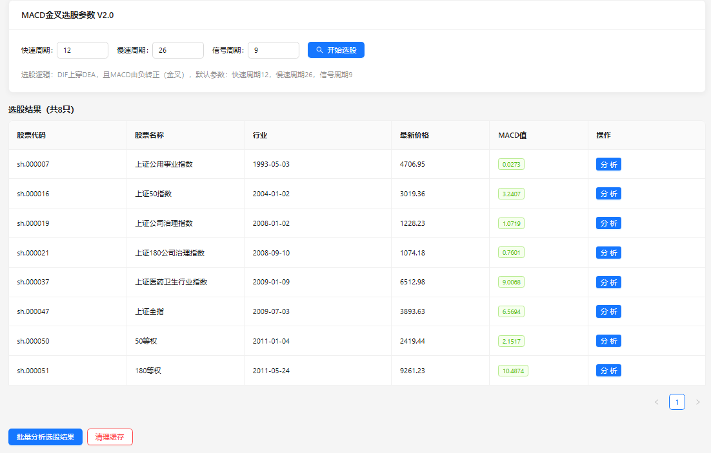
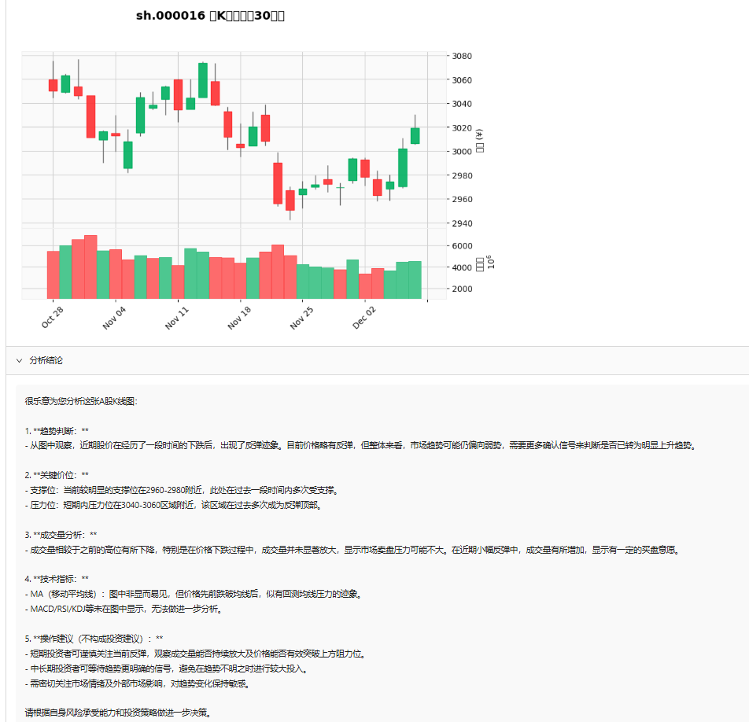
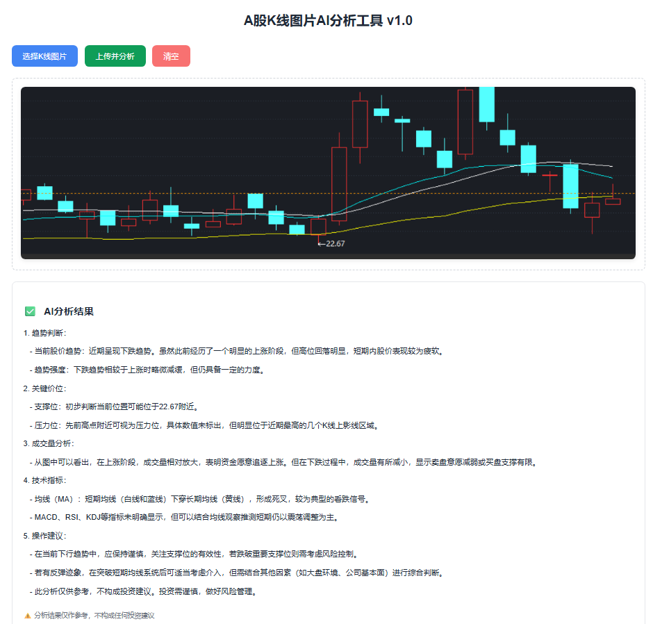

# QAuto
# A股K线图片AI分析工具 v2.0
## 核心升级点
✅ 自动选股：基于 MACD 金叉公式自动筛选符合条件的 A 股标的，取代手动上传 K 线图  
✅ 自动截图：通过 mplfinance 生成选股标的的日 K 线图，无需人工截图  
✅ Redis 缓存：缓存选股结果、K 线图、大模型分析结果，提升性能并减少 API 调用成本  
✅ 批量分析：支持对选股结果批量生成 K 线图并调用大模型分析
✅ 配置化选股：前端支持自定义选股参数（如 MACD 周期、选股数量） 



<br><br><b>Redis应用</b><br>
缓存generate_kline生成的k线图， 缓存get_stock_list生成的A股所有的股票列表,  缓存get_daily_data生成的stock当日的数据， 缓存select_stocks通过公式过滤产生的选择的股票列表

# A股K线图片AI分析工具 v1.0
基于React+TypeScript+Python+ChatGPT/Gemini的A股K线图片智能分析工具，支持上传K线截图并通过AI分析趋势、支撑位、压力位等关键信息。

## 核心功能
✅ 支持JPG/PNG/WEBP格式K线图片上传  
✅ 图片实时预览  
✅ AI智能分析（ChatGPT-4V/Gemini Pro Vision）  
✅ 结构化分析结果展示  
✅ 前后端分离架构，易扩展  

## 环境要求
### 前端
- Node.js ≥ 16.0.0
- npm ≥ 8.0.0 或 yarn ≥ 1.22.0

### 后端
- Python ≥ 3.8 & < 3.13 (recommand to use 3.12.7)
- OpenAI/Gemini API密钥（二选一）

## 快速部署步骤
<li><b>克隆/下载项目</b></li>

``` bash
cd QAuto
```
<li><b>后端部署</b></li>

``` bash
# 进入后端目录
cd backend

# 安装依赖（建议用虚拟环境）
python -m venv qauto

# 激活qauto虚拟环境
# Windows: qauto\Scripts\activate
# Mac/Linux: source qauto/bin/activate
# Git Bash 专属命令
source qauto/Scripts/activate

pip install -r requirements.txt

# 配置API密钥
cp .env.example .env
# 编辑.env文件，填入OpenAI/Gemini API密钥

# 启动后端服务
python main.py
# 服务地址： http://127.0.0.1:8000
```
<li><b>前端部署</b></li>

``` bash
# 进入前端目录
cd frontend

# 安装依赖
npm install

# 启动开发服务
npm run dev
# 访问地址：http://127.0.0.1:5173
```


